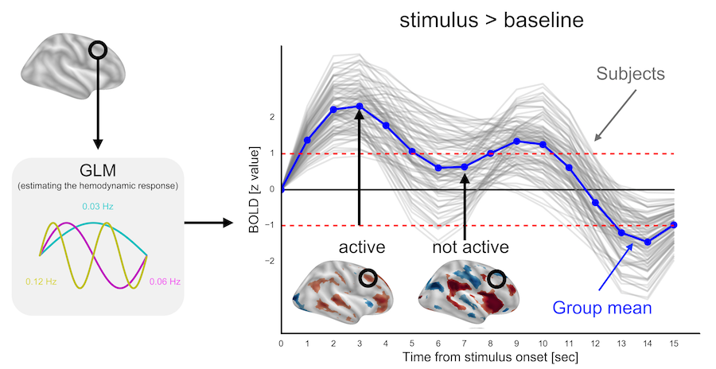

# fear-networks-over-time

## Description
This repo contains fMRI pre-processing pipeline that I used in a project that aimed to explore spatio-temporal patterns of neuronal communication during the acquisition of Pavlovian fear memory. 

## Output

This project resulted in an invited talk at [OHBM in 2017](https://www.humanbrainmapping.org/i4a/pages/index.cfm?pageID=3734) that you can watch [here](https://www.pathlms.com/ohbm/courses/5158/sections/7815/video_presentations/78437).
